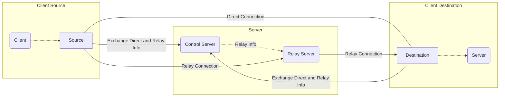

# connet

[](https://github.com/connet-dev/connet/releases)
[](https://pkg.go.dev/github.com/connet-dev/connet)
[](https://goreportcard.com/report/github.com/connet-dev/connet)
[](https://github.com/connet-dev/connet/blob/main/LICENSE)

`connet` is a peer-to-peer reverse proxy for NAT traversal. It is inspired by ngrok, frp, rathole and others.

`connet` helps expose a service running on a device to another device on the internet. Unlike the others, 
the `connet` client runs on both the device that exposes the service (called `destination` in connet's terms) 
and the device that wants to access the service (called `source`). This means that communication between `connet`
clients is never public and visible to the rest of the internet, and in many cases peers can communicate directly.

> **Status** `connet` is currently alpha software. We expect some issues and its APIs are subject to change.

## Features

 - **Peer-to-peer communication** Because you run the `connet` client on both the `destination` and the `source`, the server 
is only used for sharing configuration. In many cases clients can communicate directly, which enables better privacy and 
performance.
 - **Relay support** There are cases when clients are unable to find a path to communicate directly. In such cases, they
can use a relay server to maintain connectivity. 
 - **Security** Everything is private, encrypted with TLS. Public server and client certificates are exchanges between peers
and are required and verified to establish connectivity. Clients and relays need to present a mandatory token when communicating
with the control server, allowing tight control over who can use `connet`.
 - **Embeddable** In case you want `connet` running as part of another (golang) program (as opposed to a separate executable), 
`connet` has a well defined api for running both the client and the server.

## Architecture



For all communication `connet` uses the QUIC protocol, which is build on top of UDP. 

## Quickstart

Latest builds of `connet` can be acquired from our [releases](https://github.com/connet-dev/connet/releases) page. 
We also provide [docker](https://github.com/orgs/connet-dev/packages/container/package/connet) images,
check our [docker](#Docker) section to see how you can use them.
If you are using [NixOS](https://nixos.org), check also the [NixOS](#NixOS) section.

To get started with `connet`, you'll need 3 devices:

 - Server which your clients can communicate with. In most cases, this server will have a public IP and be directly 
accessible by clients. A VPS instance at one of the many cloud providers goes a long way here.
 - Device `D` that has the `destination` service you want to connect to, running at port `3000`.
 - Device `S` (aka `source`) which you want to connect to the service, at port `8000`. 

### Server

In the setup above, start `connet server --config server.toml` with the following `server.toml`:
```toml
[server]
tokens = ["client-d-token", "client-s-token"]
cert-file = "cert.pem"
key-file = "key.pem"
```

#### TLS Certificates

To run a `connet` server, you'll need a TLS certificate. You have a few options to create such certificate:
 - **Recommended** use an [ACME client](https://acmeclients.com/) to provision one for you. We've had good experiences 
running [lego](https://go-acme.github.io/lego/).
 - Buy a TLS certificate from a Certificate Authority like verisign, namecheap, etc.
 - Use a self-signed TLS certificate, an option most appropriate for testing. 

To create a self-signed certificate, you can use openssl. Alternatively, you can use a tool like 
[minica](https://github.com/jsha/minica). When using self-signed certificate, you'll need your clients (and relays) 
trusting the server's certificate. Copying the certificate (or CA) public key to the clients and using `server-cas`
configuration option is the easiest way to achieve this.

### Client D (aka the `destination`)

Then, on device `D` run `connet --config client-d.toml` with the following `client-d.toml`:
```toml
[client]
token = "client-d-token"
server-addr = "SERVER_IP:19190"
server-cas = "cert.pem"

[client.destinations.serviceA]
addr = ":3000"
```

### Client S (aka the `source`)

On device `S` run `connet --config client-s.toml` with the following `client-s.toml`:
```toml
[client]
token = "client-s-token"
server-addr = "SERVER_IP:19190"
server-cas = "cert.pem"

[client.sources.serviceA]
addr = ":8000"
```

## Configuration

You can use both a toml config file as well as command line when running `connet`. If you use both a config file and 
command line options, the latter takes precence, overriding any config file options. For simplicity, command line options 
only support a single `destination` or `source` configuration. 

### Client

To run a client, use `connet --config client-config.toml` command. Here is the full client `client-config.toml` 
configuration spec:
```toml
[client]
token = "client-token-1" # the token which the client uses to authenticate against the control server
token-file = "path/to/relay/token" # a file that contains the token, one of token or token-file is required

server-addr = "localhost:19190" # the control server address to connect to
server-cas = "path/to/cert.pem" # the control server certificate

direct-addr = ":19192" # at what address this client listens for direct connections, defaults to :19192
status-addr = "127.0.0.1:19182" # at what address this client listens for status connections, disabled unless set

[client.destinations.serviceX]
addr = "localhost:3000" # where this destination connects to, required
route = "any" # what kind of routes to use, `any` will use both `direct` and `relay`
proxy-proto-version = "" # proxy proto version to push origin information to the server, supports `v1` and `v2`
file-server-root = "." # when set, run a file server at current directory, on localhost:3000 address

[client.destinations.serviceY]
addr = "192.168.1.100:8000" # multiple destinations can be defined, they are matched by name at the server
route = "direct" # force only direct communication between clients

[client.sources.serviceX] # matches destinations.serviceX
addr = ":8000" # the address at which to listen for incoming connections to be forwarded
route = "relay" # the kind of route to use

[client.sources.serviceY] # both sources and destinations can be defined in a single file
addr = ":8001" # again, mulitple sources can be defined
route = "direct" # force only direct communication between clients, even if other end allows any
```

### Server

To run a server (e.g. running both control and a relay server), use `connet server --config server-config.toml` command. 
Here is the full server `server-config.toml` configuration specification:
```toml
[server]
addr = ":19190" # the address at which the control server will listen for connections, defaults to :19190
cert-file = "path/to/cert.pem" # the server certificate file, in pem format
key-file = "path/to/key.pem" # the server certificate private key file

tokens = ["client-token-1", "client-token-n"] # set of recognized client tokens
tokens-file = "path/to/client/tokens" # a file that contains a list of client tokens, one token per line
# one of tokens or tokens-file is required

relay-addr = ":19191" # the address at which the relay will listen for connectsion, defaults to :19191
relay-hostname = "localhost" # the public hostname (e.g. domain, ip address) which will be advertised to clients, defaults to localhost

status-addr = "127.0.0.1:19180" # at what address the server listens for status connections, disabled unless set
store-dir = "path/to/server-store" # where does this server persist runtime information, defaults to a /tmp subdirectory

[server.ip-restriction] # defines restriction applicable for all client tokens, checked before verifying the token
allow-cidrs = [] # set of networks in CIDR format, to allow client connetctions from
deny-cidrs = [] # set of networks in CIDR format, to deny client connetctions from

[[server.token-restriction]] # defines restriction per client token, if specified must match the number of client tokens
allow-cidrs = [] # set of networks in CIDR format, to allow token client connetctions from
deny-cidrs = [] # set of networks in CIDR format, to deny token client connetctions from
name-matches = "" # regular expression to check the name of the destination/source against
role-matches = "" # only allow specific role for this token, either 'source' or 'destination'
```

#### Control server

To run a control server, use `connet control --config control-config.toml` command. Here is the full control server 
`control-config.toml` configuration specification:
```toml
[control]
cert-file = "path/to/cert.pem" # the server certificate file, in pem format
key-file = "path/to/key.pem" # the server certificate private key file

clients-addr = ":19190" # the address at which the control server will listen for client connections, defaults to :19190
clients-tokens = ["client-token-1", "client-token-n"] # set of recognized client tokens
clients-tokens-file = "path/to/client/tokens" # a file that contains a list of client tokens, one token per line
# one of client-tokens or client-tokens-file is required

relays-addr = ":19189" # the address at which the control server will listen for relay connections, defaults to :19189
relays-tokens = ["relay-token-1", "relay-token-n"] # set of recognized relay tokens
relays-tokens-file = "path/to/relay/token" # a file that contains a list of relay tokens, one token per line
# one of relay-tokens or relay-tokens-file is necessary when connecting relays

status-addr = "127.0.0.1:19180" # at what address the control server listens for status connections, disabled unless set
store-dir = "path/to/control-store" # where does this control server persist runtime information, defaults to a /tmp subdirectory

[control.clients-ip-restriction] # defines restriction applicable for all client tokens, checked before verifying the token
allow-cidrs = [] # set of networks in CIDR format, to allow client connetctions from
deny-cidrs = [] # set of networks in CIDR format, to deny client connetctions from

[[control.clients-token-restriction]] # defines restriction per client token, if specified must match the number of client tokens
allow-cidrs = [] # set of networks in CIDR format, to allow client connetctions from
deny-cidrs = [] # set of networks in CIDR format, to deny client connetctions from
name-matches = "" # regular expression to check the name of the destination/source against
role-matches = "" # only allow specific role for this token, either 'source' or 'destination'

[control.relays-ip-restriction] # defines restriction applicable for all relay tokens, checked before verifying the token
allow-cidrs = [] # set of networks in CIDR format, to allow relay connetctions from
deny-cidrs = [] # set of networks in CIDR format, to deny relay connetctions from

[[control.relays-token-ip-restriction]] # defines restriction per relay token, if specified must match the number of relay tokens
allow-cidrs = [] # set of networks in CIDR format, to allow relay connetctions from
deny-cidrs = [] # set of networks in CIDR format, to deny relay connetctions from
```

#### Relay server

To run a relay server, use `connet relay --config relay-config.toml` command. Here is the full relay server 
`relay-config.toml` configuration specification:
```toml
[relay]
token = "relay-token-1" # the token which the relay server uses to authenticate against the control server
token-file = "path/to/relay/token" # a file that contains the token, one of token or token-file is required

addr = ":19191" # the address at which the relay will listen for connectsion, defaults to :19191
hostname = "localhost" # the public hostname (e.g. domain, ip address) which will be advertised to clients, defaults to localhost

control-addr = "localhost:19190" # the control server address to connect to, defaults to localhost:19191
control-cas = "path/to/ca/file.pem" # the public certificate root of the control server, no default, required when using self-signed certs

status-addr = "127.0.0.1:19181" # at what address the relay server listens for status connections, disabled unless set
store-dir = "path/to/relay-store" # where does this relay persist runtime information, defaults to a /tmp subdirectory
```

### IP Restrictions

You can restrict clients and relays to connect only from specific IPs using different `restriction` options. 
They accept allow/deny list of strings in CIDR format, as defined by [RFC 4632](https://www.rfc-editor.org/rfc/rfc4632.html) and 
[RFC 4291](https://www.rfc-editor.org/rfc/rfc4291.html), for example (to restrict the set of client IPs that can connect to the server):
```toml
[server.ip-restriction]
allow-cidrs = ["192.0.2.0/24"]
deny-cidrs = ["198.51.100.0/24"]
```

If these options are specified, an IP will be rejected if:
 - it matches any of the CIDRs in the `deny-cidrs` list
 - it matches none of the CIDRs in the `allow-cidrs` list. If the `allow-cidrs` list is empty, the IP will not be rejected.

### Name Restrictions

You can restrict what destinations/sources a client can start with `name-matches` options. The string you pass is
compiled to a regular expression as described in [golang syntax](https://pkg.go.dev/regexp/syntax). Only names that match
the regular expression will be allowed for this token.

### Role Restrictions

You can restrict client role via `role-matches` options. Clients using role restricted token are only allowed to act as
a `destination` or a `source`, depending on the value of the `role-matches` option.

### Storage

`connet` servers (both control and relay servers) store runtime state on the file system. If you don't explicitly specify 
`store-dir`, they will use a new subdirectory in `/tmp` by default, which means that every time they restart they'll loose
any state and identity. To prevent this, you can specify an explicit `store-dir` location, which can be reused between runs.

### Logging

At the root of the config file, you can configure logging (`connet` uses slog internally):
```toml
log-level = "info" # supports debug, info, warn, error, defaults to info
log-format = "text" # supports text and json, defaults to text
```

### Tunning

On some systems, if you might see the following line in the logs:
```
failed to sufficiently increase receive buffer size (was: 208 kiB, wanted: 7168 kiB, got: 416 kiB). See https://github.com/quic-go/quic-go/wiki/UDP-Buffer-Sizes for details.
```

In which case, we recommend visiting the [wiki page](https://github.com/quic-go/quic-go/wiki/UDP-Buffer-Sizes) and applying the recommended changes.

## Installation

Latest builds of `connet` can be acquired from our [releases](https://github.com/connet-dev/connet/releases) page. Alternatively,
you can use the following installation methods:

### NixOS

`connet` contains NixOS modules that you can use for running:
 - client via [client-module.nix](nix/client-module.nix)
 - server via [server-module.nix](nix/server-module.nix)
 - control server via [control-server-module.nix](nix/control-server-module.nix)
 - relay server via [relay-server-module.nix](nix/relay-server-module.nix)

To configure the client as a service:
```nix
# configuration.nix
{ config, pkgs, ... }:
let
  connet-repo = builtins.fetchGit {
    url = "https://github.com/connet-dev/connet";
    ref = "main";
  };
in
{
  imports = [
    # ...
    "${connet-repo}/nix/client-module.nix"
  ];
  # ...
  services.connet-client = {
    enable = true;
    settings.client = {
      token-file = "/run/keys/connet.token";
      server-addr = "localhost:19190";
      sources.example.addr = ":9000";
    };
  };
}
```

#### Flakes

To configure the client as a service:
```nix
# flake.nix
{
  inputs = {
    # ...
    connet.url = "github.com/connet-dev/connet";
  };
  outputs = { connet, ... }: {
    nixosConfigurations.example = nixpkgs.lib.nixosSystem {
      system = "x86_64-linux";
      modules = [
        # ...
        connet.nixosModules.default
        {
          services.connet-client = {
            enable = true;
            settings.client = {
              token-file = "/run/keys/connet.token";
              server-addr = "localhost:19190";
              sources.example.addr = ":9000";
            };
          };
        }
      ];
    };
  };
}
```

### Docker

Docker images are available at [ghcr.io](https://ghcr.io) and you can pull them via:
```bash
docker pull ghcr.io/connet-dev/connet:latest
```

To run the client you can use something like:
```bash
docker run -p 19192:19192 -p 9000:9000 connet \
  --server-addr "localhost:19190" --token "CLIENT_TOKEN" \
  --src-name "example" --src-addr ":9000"
```

Or if you are using a config file on your system:
```bash
docker run -p 19192:19192 -p 9000:9000 \
  --mount "type=bind,source=/path/to/config,target=/data" \
  connet --config "/data/config.toml"
```

## Examples

TBD

## Hosting

If you want to use `connet`, but you don't want to run the server yourself, we have also built a hosted service 
at [connet.dev](https://connet.dev). It is free when clients connect directly, builds upon the open source components 
by adding account management and it is one of the easiest way to start. 

## Changelog

### v0.5.0
 - [x] Stateless reset key for the server
 - [x] Name access restrictions for clients
 - [x] File http server
 - [x] Use quic-go tracer, instead of ping (and duration estimation)
 - [x] Optimize global IP restrictions - check earlier
 - [x] Role restrictions for clients
 - [x] proxy proto support
 - [x] update nix modules with new config options

## Future

 - [ ] error wrapping
 - [ ] zip and name windows executable .exe
 - [ ] UDP support
 - [ ] Gen config
 - [ ] http source
 - [ ] client stateless reset key
 - [ ] systemd dynamic user in nixos
 - [ ] client versioning support
 - [ ] UPnP and other methods for hole-punching
 - [ ] Docs section for building the project
 - [ ] Docs section for embedding into golang programs
 - [ ] mininet testing
 - [ ] nixos testing
 - [ ] notarize mac app
 - [ ] websocket tcp converter
