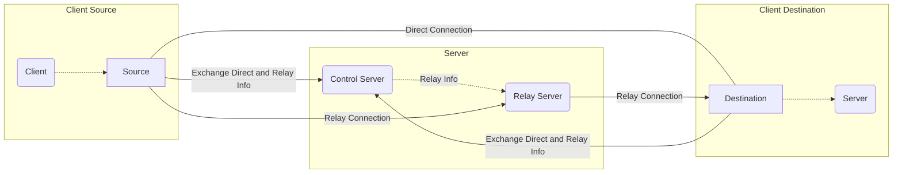

# connet

[](https://github.com/connet-dev/connet/releases)
[](https://pkg.go.dev/github.com/connet-dev/connet)
[](https://goreportcard.com/report/github.com/connet-dev/connet)
[](https://github.com/connet-dev/connet/blob/main/LICENSE)

`connet` is a peer-to-peer reverse proxy for NAT traversal. It is inspired by ngrok, frp, rathole and others.

`connet` helps expose a service running on a device to another device on the internet. Unlike the others, 
the `connet` client runs on both the device that exposes the service (called `destination` in connet's terms) 
and the device that wants to access the service (called `source`). This means that communication between `connet`
clients is never public and visible to the rest of the internet, and in many cases peers can communicate directly.

> **Status** `connet` is currently alpha software. We expect some issues and its APIs are subject to change.

## Features

 - **Peer-to-peer communication** Because you run the `connet` client on both the `destination` and the `source`, the server 
is only used for sharing configuration. In many cases clients can communicate directly, which enables better privacy and 
performance.
 - **Relay support** There are cases when clients are unable to find a path to communicate directly. In such cases, they
can use a relay server to maintain connectivity. 
 - **Security** Everything is private, encrypted with TLS. Public server and client certificates are exchanges between peers
and are required and verified to establish connectivity. Clients and relays need to present a mandatory token when communicating
with the control server, allowing tight control over who can use `connet`.
 - **Embeddable** In case you want `connet` running as part of another (golang) program (as opposed to a separate executable), 
`connet` has a well defined api for running both the client and the server.

## Architecture



For all communication `connet` uses the QUIC protocol, which is build on top of UDP. 

## Quickstart

Latest builds of `connet` can be acquired from our [releases](https://github.com/connet-dev/connet/releases) page. 
We also provide [docker](https://github.com/orgs/connet-dev/packages/container/package/connet) images,
check our [docker](#Docker) section to see how you can use them.
For [NixOS](https://nixos.org), check the [NixOS](#NixOS) section.
See the [Arch Linux](#Arch-Linux-community) section for Arch.

To get started with `connet`, you'll need 3 devices:

 - Server which your clients can communicate with. In most cases, this server will have a public IP and be directly 
accessible by clients. A VPS instance at one of the many cloud providers goes a long way here.
 - Device `D` that has the `destination` service you want to connect to, running at port `3000`.
 - Device `S` (aka `source`) which you want to connect to the service, at port `8000`. 

### Server

In the setup above, start `connet server --config server.toml` with the following `server.toml`:
```toml
[server]
tokens = ["client-d-token", "client-s-token"]

[[server.ingress]]
cert-file = "cert.pem"
key-file = "key.pem"
```

#### TLS Certificates

To run a `connet` server, you'll need a TLS certificate. You have a few options to create such certificate:
 - **Recommended** use an [ACME client](https://acmeclients.com/) to provision one for you. We've had good experiences 
running [lego](https://go-acme.github.io/lego/).
 - Buy a TLS certificate from a Certificate Authority like verisign, namecheap, etc.
 - Use a self-signed TLS certificate, an option most appropriate for testing. 

To create a self-signed certificate, you can use openssl. Alternatively, you can use a tool like 
[minica](https://github.com/jsha/minica). When using self-signed certificate, you'll need your clients (and relays) 
trusting the server's certificate. Copying the certificate (or CA) public key to the clients and using `server-cas`
configuration option is the easiest way to achieve this.

### Client D (aka the `destination`)

Then, on device `D` run `connet --config client-d.toml` with the following `client-d.toml`:
```toml
[client]
token = "client-d-token"
server-addr = "SERVER_IP:19190"
server-cas = "cert.pem"

[client.destinations.serviceA]
url = "tcp://:3000"
```

### Client S (aka the `source`)

On device `S` run `connet --config client-s.toml` with the following `client-s.toml`:
```toml
[client]
token = "client-s-token"
server-addr = "SERVER_IP:19190"
server-cas = "cert.pem"

[client.sources.serviceA]
url = "tcp://:8000"
```

## Configuration

You can use both a toml config file as well as command line when running `connet`. If you use both a config file and 
command line options, the latter takes precence, overriding any config file options. For simplicity, command line options 
only support a single `destination` or `source` configuration. 

### Client

To run a client, use `connet --config client-config.toml` command. Here is the full client `client-config.toml` 
configuration spec:
```toml
[client]
token = "client-token-1" # the token which the client uses to authenticate against the control server
token-file = "path/to/relay/token" # a file that contains the token, one of token or token-file is required

server-addr = "localhost:19190" # the control server address to connect to
server-cas = "path/to/cert.pem" # the control server certificate

direct-addr = ":19192" # at what address this client listens for direct connections, defaults to :19192
direct-stateless-reset-key = "" # the quic stateless reset key as a literal 32 byte value in bas58 format
direct-stateless-reset-key-file = "/path/to/reset/key" # the quic stateless reset key read from a file
status-addr = "127.0.0.1:19182" # at what address this client listens for status connections, disabled unless set
nat-pmp = "system" # support for NAT-PMP, defaults to `system`

relay-encryptions = ["none"] # require encryption when using relay for all destination/sources, defaults to "none"

[client.destinations.serviceX]
route = "any" # what kind of routes to use, `any` will use both `direct` and `relay`
relay-encryptions = ["tls", "dhxcp"] # require `tls` or `dhxcp` encryption when using relay for this destination
proxy-proto-version = "" # proxy proto version to push origin information to the server, supports `v1` and `v2`
url = "tcp://localhost:3000" # url to which destination connects to, over tcp
# other options for the url field:
url = "tls://localhost:3000" # a tls destination to connect to
url = "http://localhost:3000/path" # an http destination to connect to as a reverse proxy, path rewrite included
url = "https://localhost:3000" # an https destination to connect to as a reverse proxy
url = "file:///absolute/path" # an absolute file path to serve over http
url = "file:./relative/path" # a relativefile path to serve over http
cas-file = "/path/to/cas/file" # if connecting via tls/https, certificate authorities if not publicly trusted
                               # `insecure-skip-verify` is a special value, to not verify self-signed certificates
cert-file = "/path/to/cert/file" # when connecting via tls/https, client certificate to present (mutual tls)
key-file = "/path/to/key/file" # when connecting via tls/https, client certificate private key to present (mutual tls)

[client.destinations.serviceY]
route = "direct" # force only direct communication between clients
url = "tcp://192.168.1.100:8000"

[client.sources.serviceX] # matches destinations.serviceX
route = "relay" # the kind of route to use
relay-encryptions = ["dhxcp"] # require `dhxcp` encryption when using relay for this source
url = "tcp://:8000" # url for the source to listen for incoming connections to be forwarded
# other options for the url field:
url = "tls://:8003" # runs a tls source server
url = "http://:8080/path" # runs an http reverse proxy source server, path rewrite
url = "https://:8443" # runs an https reverse proxy source server
url = "ws://127.0.0.1:8080" # runs websocket tcp converter that exposes the destinations conn as a websocket
url = "wss://127.0.0.1:8083" # same as above, but exposes it on https
cert-file = "/path/to/cert/file" # the tls/https server certificate to use
key-file = "/path/to/key/file" # the tls/https server certificate private key to use

[client.sources.serviceY] # both sources and destinations can be defined in a single file
route = "direct" # force only direct communication between clients, even if other end allows any
url = "tcp://:8001" # again, mulitple sources can be defined
```

#### Client environment

The client uses the following environment variables, in case the associated fields in the config file are empty:
 - `CONNET_TOKEN` - pass the client's token from as env variable, used when `token` and `token-file` are empty
 - `CONNET_CACHE_DIR` - specifies the location of the stateless reset token, used when `direct-stateless-reset-key`
   and `direct-stateless-reset-key-file` are empty
 - `CACHE_DIRECTORY` - used after trying to use `CONNET_CACHE_DIR`, another location for the stateless reset token. This
   variable is usually specified by systemd
 - `XDG_CACHE_HOME` - the cache directory, as specified by XDG, used if both `CONNET_CACHE_DIR` and `CACHE_DIRECTORY` are empty

### Server

To run a server (e.g. running both control and a relay server), use `connet server --config server-config.toml` command. 
Here is the full server `server-config.toml` configuration specification:
```toml
[server]
tokens = ["client-token-1", "client-token-n"] # set of recognized client tokens
tokens-file = "path/to/client/tokens" # a file that contains a list of client tokens, one token per line
# one of tokens or tokens-file is required

status-addr = "127.0.0.1:19180" # at what address the server listens for status connections, disabled unless set
store-dir = "path/to/server-store" # where does this server persist runtime information, defaults to a /tmp subdirectory

[[server.ingress]] # defines how to accept client connections, can define mulitple
addr = ":19190" # the address at which the control server will listen for client connections, defaults to :19190
cert-file = "path/to/cert.pem" # the client server certificate file, in pem format
key-file = "path/to/key.pem" # the client server certificate private key file
allow-cidrs = [] # set of networks in CIDR format, to allow client connetctions from
deny-cidrs = [] # set of networks in CIDR format, to deny client connetctions from

[[server.token-restriction]] # defines restriction per client token, if specified must match the number of client tokens
allow-cidrs = [] # set of networks in CIDR format, to allow token client connetctions from
deny-cidrs = [] # set of networks in CIDR format, to deny token client connetctions from
name-matches = "" # regular expression to check the name of the destination/source against
role-matches = "" # only allow specific role for this token, either 'source' or 'destination'

[[server.relay-ingress]]
addr = ":19191" # the address at which the relay will listen for connectsion, defaults to :19191
hostports = ["localhost"] # the public host[:port] (e.g. domain, ip address) which will be advertised to clients, defaults to localhost:<port of address>
allow-cidrs = [] # set of networks in CIDR format, to allow client relay connetctions from
deny-cidrs = [] # set of networks in CIDR format, to deny client relay connetctions from
```

#### Control server

To run a control server, use `connet control --config control-config.toml` command. Here is the full control server 
`control-config.toml` configuration specification:
```toml
[control]
clients-tokens = ["client-token-1", "client-token-n"] # set of recognized client tokens
clients-tokens-file = "path/to/client/tokens" # a file that contains a list of client tokens, one token per line
# one of client-tokens or client-tokens-file is required

relays-tokens = ["relay-token-1", "relay-token-n"] # set of recognized relay tokens
relays-tokens-file = "path/to/relay/token" # a file that contains a list of relay tokens, one token per line
# one of relay-tokens or relay-tokens-file is required if connecting relays

status-addr = "127.0.0.1:19180" # at what address the control server listens for status connections, disabled unless set
store-dir = "path/to/control-store" # where does this control server persist runtime information, defaults to a /tmp subdirectory

[[control.clients-ingress]] # defines how client connections will be accepted, can add mulitple
addr = ":19190" # the address at which the control server will listen for client connections, defaults to :19190
cert-file = "path/to/cert.pem" # the clients server certificate file, in pem format
key-file = "path/to/key.pem" # the clients server certificate private key file
allow-cidrs = [] # set of networks in CIDR format, to allow client connetctions from
deny-cidrs = [] # set of networks in CIDR format, to deny client connetctions from

[[control.clients-token-restriction]] # defines restriction per client token, if specified must match the number of client tokens
allow-cidrs = [] # set of networks in CIDR format, to allow client connetctions from
deny-cidrs = [] # set of networks in CIDR format, to deny client connetctions from
name-matches = "" # regular expression to check the name of the destination/source against
role-matches = "" # only allow specific role for this token, either 'source' or 'destination'

[[control.relays-ingress]] # defines how relay connections will be accepted, can add mulitple
addr = ":19189" # the address at which the control server will listen for relay connections, defaults to :19189
cert-file = "path/to/cert.pem" # the relays server certificate file, in pem format
key-file = "path/to/key.pem" # the relays server certificate private key file
allow-cidrs = [] # set of networks in CIDR format, to allow relay connetctions from
deny-cidrs = [] # set of networks in CIDR format, to deny relay connetctions from

[[control.relays-token-restriction]] # defines restriction per relay token, if specified must match the number of relay tokens
allow-cidrs = [] # set of networks in CIDR format, to allow relay connetctions from
deny-cidrs = [] # set of networks in CIDR format, to deny relay connetctions from
```

#### Relay server

To run a relay server, use `connet relay --config relay-config.toml` command. Here is the full relay server 
`relay-config.toml` configuration specification:
```toml
[relay]
token = "relay-token-1" # the token which the relay server uses to authenticate against the control server
token-file = "path/to/relay/token" # a file that contains the token, one of token or token-file is required

control-addr = "localhost:19190" # the control server address to connect to, defaults to localhost:19191
control-cas = "path/to/ca/file.pem" # the public certificate root of the control server, no default, required when using self-signed certs

status-addr = "127.0.0.1:19181" # at what address the relay server listens for status connections, disabled unless set
store-dir = "path/to/relay-store" # where does this relay persist runtime information, defaults to a /tmp subdirectory

[[relay.ingress]] # defines how relay server will accept client connections, defaults to "localhost:19191"
addr = ":19191" # the address at which the relay will listen for connectsion, defaults to :19191
hostports = ["localhost:19191"] # the public host:port (e.g. domain, ip address) which will be advertised to clients, defaults to localhost:[addr.port]
allow-cidrs = [] # set of networks in CIDR format, to allow client connetctions from
deny-cidrs = [] # set of networks in CIDR format, to deny client connetctions from
```

#### Servers environment

The server (including control/relay server) uses the following environment variables, in case the associated fields in
the config file are empty:
 - `CONNET_STATE_DIR` - used when `store-dir` is empty, to setup explicitly from the environment
 - `STATE_DIRECTORY` - used as a fallback after `CONNET_STATE_DIR`, usually setup by systemd
 - `TMPDIR` - as a final fallback for finding `store-dir` location, falling back to `/tmp` if unset 

### NAT Management

`connet` can detect and control a nat device, to provide additional routes to connect clients. Currently it implements:
 - NAT-PMP (rfc6886), controlled by `nat-pmp` option. By default, the option is configured as `system`
(e.g. using the local system to detect local ip and router). You can use `disabled` to completely disable nat-pmp. On
some systems (for example android), access to ip/router information is restricted, in which case you can try the `dial` option
which will try to dynamically determine this information by dialing in the control server.

### IP Restrictions

You can restrict clients and relays to connect only from specific IPs using different `restriction` options. 
They accept allow/deny list of strings in CIDR format, as defined by [RFC 4632](https://www.rfc-editor.org/rfc/rfc4632.html) and 
[RFC 4291](https://www.rfc-editor.org/rfc/rfc4291.html), for example (to restrict the set of client IPs that can connect to the server):
```toml
[[server.ingress]]
allow-cidrs = ["192.0.2.0/24"]
deny-cidrs = ["198.51.100.0/24"]
```

If these options are specified, an IP will be rejected if:
 - it matches any of the CIDRs in the `deny-cidrs` list
 - it matches none of the CIDRs in the `allow-cidrs` list. If the `allow-cidrs` list is empty, the IP will not be rejected.

### Name Restrictions

You can restrict what destinations/sources a client can start with `name-matches` options. The string you pass is
compiled to a regular expression as described in [golang syntax](https://pkg.go.dev/regexp/syntax). Only names that match
the regular expression will be allowed for this token.

### Role Restrictions

You can restrict client role via `role-matches` options. Clients using role restricted token are only allowed to act as
a `destination` or a `source`, depending on the value of the `role-matches` option.

### Relay Encryption

`connet` has the capability to encrypt a connection between a `source` and a `destination` when using a relay, therefore hiding
the contents of what is transferred between them. The possible values for `relay-encryptions` are:
 - `none` - no encryption. Good when using trusted relays (e.g. under your control) for best performance and system load
 - `tls` - setup TLS based on the exchanged client/server certificates. Well understood and mature option, but requires additional
roundtrips between client and server to setup TLS within the TLS connection to the relay.
 - `dhxcp` - new option which does ephemeral (e.g. per connection) ECDH/X25519 exchange as part of the source/destination connect
and asymmetrically encrypts data with Chacha20Poly1305. A good comporimse between maturity, security, and performance.

By default `connet` doesn't encrypt relay connections (`relay-encryptions = ["none"]`) (e.g. you are running your own trusted relay).
When multiple values are set (e.g. `relay-encryptions = ["none", "dhxcp", "tls"]`) it will prefer the most secure/mature option
(`tls` in this case, then `dhxp`), but fallback to `none` in case the other peer is not configured to use encryption yet.
Only setting one encryption option (for example `relay-encryptions = ["tls"]`), is the most strict configuration, which will
require same encryption at both clients (e.g. source and destination).  

### Storage

`connet` servers (both control and relay servers) store runtime state on the file system. If you don't explicitly specify 
`store-dir`, they will use a new subdirectory in `/tmp` by default, which means that every time they restart they'll loose
any state and identity. To prevent this, you can specify an explicit `store-dir` location, which can be reused between runs.

### Logging

At the root of the config file, you can configure logging (`connet` uses slog internally):
```toml
log-level = "info" # supports debug, info, warn, error, defaults to info
log-format = "text" # supports text and json, defaults to text
```

### Tunning

On some systems, if you might see the following line in the logs:
```
failed to sufficiently increase receive buffer size (was: 208 kiB, wanted: 7168 kiB, got: 416 kiB). See https://github.com/quic-go/quic-go/wiki/UDP-Buffer-Sizes for details.
```

In which case, we recommend visiting the [wiki page](https://github.com/quic-go/quic-go/wiki/UDP-Buffer-Sizes) and applying the recommended changes.

### QUIC stateless reset key

#### Client

If neither `direct-stateless-reset-key` nor `direct-stateless-reset-key-file` has been set, a new key file will be created
under the user cache dir (`$XDG_CACHE_DIR` or `$HOME/.cache` on linux), suffixed with the direct address of this client.

#### Server

The server is generating its stateless reset key internally as part of its state kept in `state-dir`.

## Installation

Latest builds of `connet` can be acquired from our [releases](https://github.com/connet-dev/connet/releases) page. Alternatively,
you can use the following installation methods:

### NixOS

`connet` contains NixOS modules that you can use for running:
 - client via [client-module.nix](nix/client-module.nix)
 - server via [server-module.nix](nix/server-module.nix)
 - control server via [control-server-module.nix](nix/control-server-module.nix)
 - relay server via [relay-server-module.nix](nix/relay-server-module.nix)

To configure the client as a service:
```nix
# configuration.nix
{ config, pkgs, ... }:
let
  connet-repo = builtins.fetchGit {
    url = "https://github.com/connet-dev/connet";
    ref = "main";
  };
in
{
  imports = [
    # ...
    "${connet-repo}/nix/client-module.nix"
  ];
  # ...
  services.connet-client = {
    enable = true;
    settings.client = {
      token-file = "/run/keys/connet.token";
      server-addr = "localhost:19190";
      sources.example.url = "tcp://:9000";
    };
  };
}
```

#### Flakes

To configure the client as a service:
```nix
# flake.nix
{
  inputs = {
    # ...
    connet.url = "github.com/connet-dev/connet";
  };
  outputs = { connet, ... }: {
    nixosConfigurations.example = nixpkgs.lib.nixosSystem {
      system = "x86_64-linux";
      modules = [
        # ...
        connet.nixosModules.default
        {
          services.connet-client = {
            enable = true;
            settings.client = {
              token-file = "/run/keys/connet.token";
              server-addr = "localhost:19190";
              sources.example.url = "tcp://:9000";
            };
          };
        }
      ];
    };
  };
}
```

### Arch Linux (community)

`connet` is available in the [AUR](https://aur.archlinux.org/packages/connet) and can be installed using an AUR helper (e.g. paru):
```bash
paru -S connet
```

### Docker

Docker images are available at [ghcr.io](https://ghcr.io) and you can pull them via:
```bash
docker pull ghcr.io/connet-dev/connet:latest
```

To run the client you can use something like:
```bash
docker run -p 19192:19192 -p 9000:9000 connet \
  --server-addr "localhost:19190" --token "CLIENT_TOKEN" \
  --src-name "example" --src-url "tcp://:9000"
```

Or if you are using a config file on your system:
```bash
docker run -p 19192:19192 -p 9000:9000 \
  --mount "type=bind,source=/path/to/connet.toml,target=/config/connet.toml" \
  connet --config "/config/connet.toml"
```

## Embedding

Both `connet` client and server (including control and relays) are meant to be embeddable in other programs
(`connet` main just exposes them as CLI). 

### Embedding the client

To create new client use `connet.Connect` function. It will block, while trying to connect and authenticate
to the control server. Any error that happens while connecting will be reported back. The client will continue
reconnecting until the client is `Close`ed. Here is a minimal example of creating new client:

```go
cl, err := connect.Connect(ctx, connet.ClientToken("CLIENT_TOKEN"), connet.ClientControlAddress("connet.dev:19190"))
if err != nil {
  return err
}
defer cl.Close()
// at this point, the client is connected and ready to add destinations/sources
```

To create a new destination or source use the `client.Destination` and `client.Source` methods on the client, for example:

```go
dst, err := cl.Destination(ctx, connet.NewDestinationConfig("example"))
if err != nil {
  return err
}
defer dst.Close()

// or alternatively a source
src, err := cl.Source(ctx, connet.NewSourceConfig("example"))
if err != nil {
  return err
}
defer dst.Close()
```

Once you have a destination or a source, you can use `Destination.Accept` to handle new remote connections for this destination
or `Source.Dial` to connect remotely to a destination. Both return a normal `net.Conn` that you can use for comms.

### Embedding the server (control or relay)

TBD

## Examples

TBD

## Hosting

If you want to use `connet`, but you don't want to run the server yourself, we have also built a hosted service 
at [connet.dev](https://connet.dev). It is free when clients connect directly, builds upon the open source components 
by adding account management and it is one of the easiest way to start. 

## Changelog

### v0.5.0
 - [x] Stateless reset key for the server
 - [x] Name access restrictions for clients
 - [x] File http server
 - [x] Use quic-go tracer, instead of ping (and duration estimation)
 - [x] Optimize global IP restrictions - check earlier
 - [x] Role restrictions for clients
 - [x] proxy proto support
 - [x] update nix modules with new config options

### v0.6.0
 - [x] nixos testing
 - [x] error wrapping
 - [x] support for multiple config files
 - [x] token passed from cmd should override tokenfile from config
 - [x] client stateless reset key (XDG cache dir by default)
 - [x] untrusted relay encryption
   - [x] support encryption with TLS
   - [x] direct key exchange, signed by certs
 - [x] dial/accept support for src/dst
 - [x] zip and name windows executable .exe

### v0.7.0
 - [x] dynamic source/destination in the client
 - [x] tls source/destination
 - [x] docs section for embedding into golang programs
 - [x] sni rewrite
 - [x] http source
 - [x] http host rewrite
 - [x] websocket tcp converter
 - [x] client versioning support

### v0.8.0
 - [x] info log on adding/removing endpoint
 - [x] websocket join as a func
 - [x] info log on client connecting
 - [x] multiple ingress addrs
 - [x] protos in single folder, subpackages

### v0.9.0
 - [x] remove expired protocol fields
 - [x] remove expired protocols
 - [x] refactor protocol errors
 - [x] from forward to endpoint
 - [x] compact control/relay stores
 - [x] Support for NAT-PMP (rfc 6886)

### v0.9.1
 - [x] compact mulitple segments in stores

### v0.9.2
 - [x] fix docker stateless reset file error
 - [x] improve env usage, pass token from env

### v0.9.3
 - [x] combined control/client runner
 - [ ] fix help for store dir (servers) and other flags

### v0.10.0
 - [ ] preshared clients - controless p2p
 - [ ] destination load balance
 - [ ] package refactor/rename
 - [ ] embed version when building
 - [ ] UPnP/IDG and PCP for hole-punching
 - [ ] api to control client/control/relay

## Future
 - [ ] UDP support
 - [ ] notarize mac app
 - [ ] systemd dynamic user in nixos
 - [ ] docs section for building the project
 - [ ] mininet testing
 - [ ] gen config
 - [ ] swift/ios/mac and java/android client libraries
 - [ ] relay-to-relay forwarding
